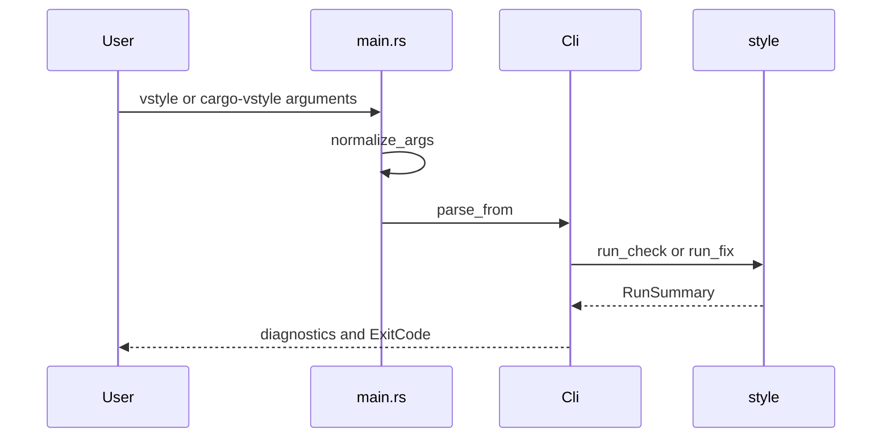

# CLI

`src/cli.rs` defines the `Cli` parser, three commands, cargo-like selection options, and process exit behavior. `src/main.rs` removes an optional `vstyle` argument in the `cargo-vstyle vstyle ...` shape before Clap parses the command.

## Commands and options

- `curate --language rust|swift` scans and reports violations. It returns failure when any violation exists; `--strict` changes only the message wording for this command.
- `tune --language rust|swift` runs safe automatic fixes and re-checks. It returns success with remaining violations unless `--strict` is supplied.
- `coverage` prints every entry in `STYLE_RULE_IDS` as `implemented`.
- `--workspace` selects all supported workspace roots; `-p/--package` selects packages; `--features`, `--all-features`, and `--no-default-features` are passed into Cargo-aware discovery and semantic checks.
- Global `--verbose` prints semantic cache statistics and tune progress telemetry.

## Change surface and checks

Keep parser fields and conversion in `CargoCliOptions::as_options` synchronized with `CargoOptions`. If adding a command, update `Command`, `Cli::run`, help text, and focused parser tests in `src/cli.rs`; if the cargo-subcommand shape changes, update `normalize_args` and its unit test in `src/main.rs`. Validate with `cargo test cli` or the narrower `cargo test --bin vstyle cli::tests::parses_tune_subcommand` when appropriate.
