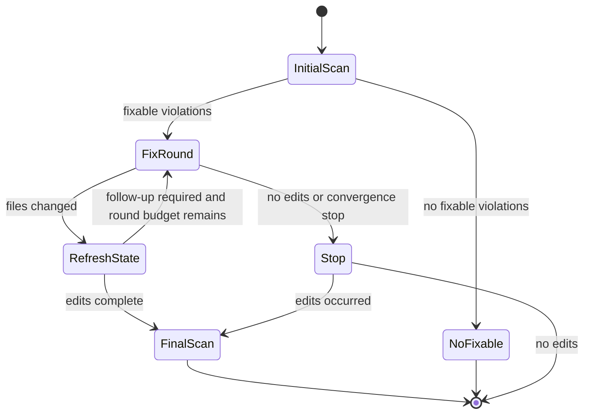

# Check and Fix Engine

`src/style.rs` owns the lifecycle. `run_check` resolves files through `shared::resolve_files`, collects rule outcomes, and returns a `RunSummary`. `run_fix` resets semantic cache counters, snapshots every selected source file, performs an initial scan, applies up to `MAX_TUNE_ROUNDS` rounds, refreshes state for changed files, and performs a final scan when at least one edit was applied. If an internal error occurs after writes, the command restores the command-start snapshot; the complete contract is [tune failure atomicity](../specifications/tune-failure-atomicity.md).

The engine groups work into file/package scopes. Checking can use Rayon; fix scopes are parallelized only when `should_parallelize_fix_scopes` proves they are independent. `CheckState` keeps per-file counts and updates aggregate violation and manual-fix counts by subtracting the prior file entry before adding the refreshed one.

Fix collection produces `Edit` ranges. `src/style/fixes.rs` applies compatible edits, while rule-specific metadata records import fallback, `let mut` reorder, and type-alias rename follow-up work. Overlapping edits are deferred rather than blindly composed; [derive interaction](../specifications/style-import-derive-interactions.md) specifies the important derive case.

## Change recipes

For a new fix, add the detector/edit producer in its rule family, ensure the edit is represented in the file outcome and any required semantic fallback, then add a fixture test that asserts both source result and remaining diagnostics. For lifecycle changes, update the stop conditions and tests around initial, unchanged, multi-round, and failed-validation paths. Narrow checks include `cargo test --test let_mut_reorder --test type_alias_rename` and `cargo test --test pub_use_self_group`; use the full all-target test only when shared orchestration changes broadly.
