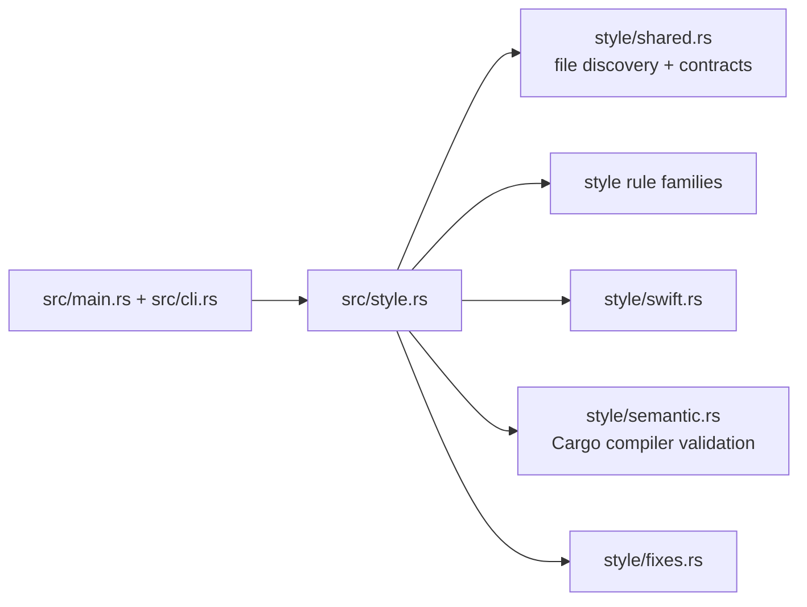

# Architecture Overview

`vibe-style` is one Cargo package with two binaries, `vstyle` and `cargo-vstyle`, both built from `src/main.rs`. The executable owns CLI parsing and delegates to the `style` module; the style module selects files, runs language-specific detectors, formats stable rule diagnostics, and optionally applies deterministic edits.

## Composition

`src/style.rs` is the orchestration boundary. `run_check` resolves the selected files and collects parallel check outcomes. `run_fix` performs an initial scan, bounded fix rounds, state refreshes, semantic fallbacks where needed, and a final scan. `src/style/shared.rs` defines `CargoOptions`, `StyleLanguage`, `Violation`, `Edit`, `RunSummary`, `FileContext`, `TopItem`, the 43-entry `STYLE_RULE_IDS` registry, workspace discovery, and diagnostic formatting. The complete ID-to-backend classification is canonical in [style rule backends](../specifications/style-rule-backends.md), not enumerated by this architecture overview.

Rule families are split by responsibility: `file.rs`, `module.rs`, `imports.rs`, `impls.rs`, `generics.rs`, `types.rs`, `bindings.rs`, `quality.rs`, `spacing.rs`, and `test_modules.rs`; Swift has its separate source-text backend in `swift.rs`. Compiler-backed behavior is isolated in `semantic.rs` rather than treated as ordinary AST detection.

## Change navigation

- Change command parsing or exits in [CLI](cli.md), then run the focused CLI tests.
- Change discovery, edit conflict handling, rounds, or convergence in [Engine](engine.md).
- Change a rule contract or registration in [Rules](rules.md) and the normative [backend specification](../specifications/style-rule-backends.md).
- Change compiler validation or cache behavior in [Semantic validation](semantic-validation.md).
- Change Swift checks only within [Swift](swift.md) and its [applicability specification](../specifications/swift-style-rule-applicability.md).

The package has no separate public library entrypoint: consumers use the binaries or the Cargo subcommand. Release and Action packaging are documented in [testing and automation](testing-and-automation.md).
