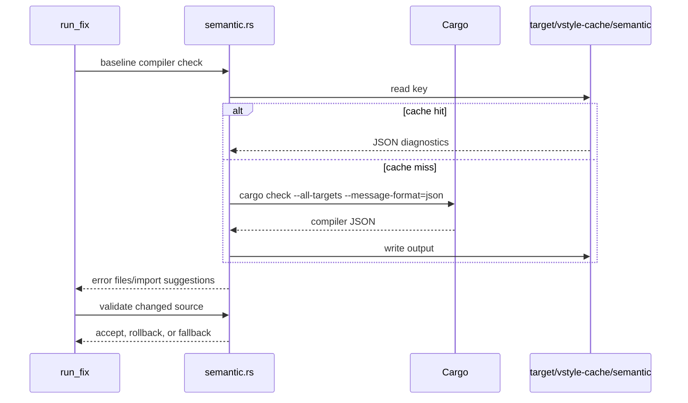

# Semantic Validation

`src/style/semantic.rs` is the compiler boundary. It invokes `cargo check --all-targets --message-format=json`, extracts compiler-error files and missing-import suggestions, and validates changes that can alter binding semantics. `src/style.rs` supplies baseline and post-edit error sets to its fallback logic, while the whole-command restore boundary is specified in [tune failure atomicity](../specifications/tune-failure-atomicity.md).

## Lifecycle

`VSTYLE_MAX_IMPORT_SUGGESTION_ROUNDS` is read once: missing uses `2`, invalid text or `0` uses `2`, values above `16` use `16`, and valid values from `1..=16` are honored. The semantic cache lives under `target/vstyle-cache/semantic`. Its key includes `CARGO_PKG_VERSION`, `VERGEN_GIT_SHA`, target triple, rustc signature, `Cargo.lock` fingerprint, semantic Cargo arguments, and sorted fingerprints of selected style files. Cache failures fall back to a subprocess check and are reported only in verbose mode.

Compiler output is scoped back to selected style files. Import suggestions are applied only to those files and are bounded by the round setting. A semantic-positive change must test both the baseline-error and post-edit paths; a zero-hit/zero-miss release run did not exercise semantic validation.

## Validation

Use `cargo make bench-semantic-vstyle` for semantic changes. The harness builds `final-release` by default, creates a temporary fixture with safe and unsafe `let mut` cases, records cold and warm tune timings/cache counts under `target/vstyle-bench-semantic/`, and removes the fixture. Use `cargo test --test let_mut_reorder` for focused behavioral evidence. Release-wide evidence is separate in [benchmark tracking](../runbooks/benchmark-tracking.md).
